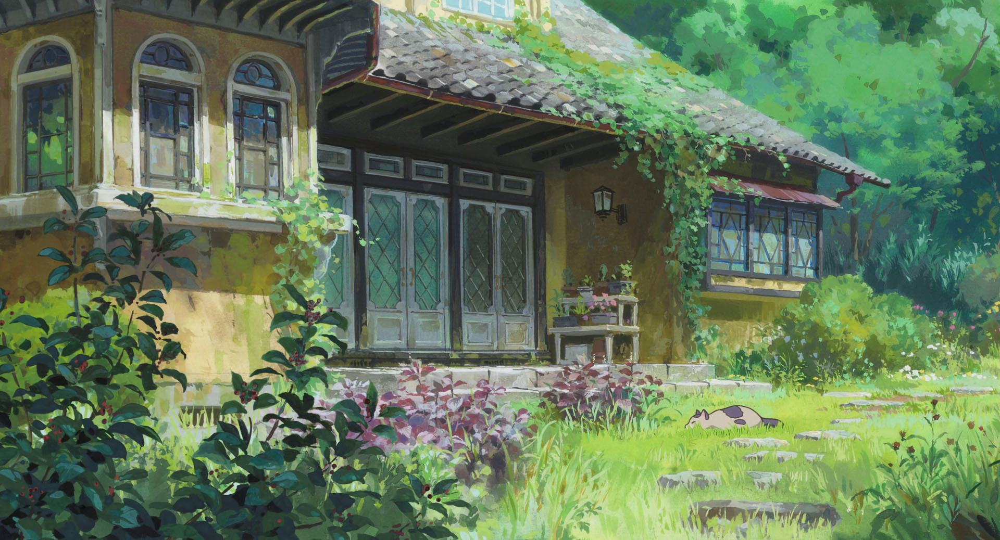

A Simple Image element that is rendered using the HTML `` tag.

<!--more-->

## Features
- Supports standard Markdown image syntax `` and alternative  
shortcode  ``.
- Supports aria-label and tooltip text using alt text.
- Supports adding caption using the title attribute.
- Supports image resizing using custom `width` and `height` attributes.
- Supports loading images from page resource, site resource or remote URLs.
- Allows adding custom CSS classes with the `class` attribute.
- Offers preset variations for contextual theming.
- Handles dark/light mode visibility via `hideindark`/`hideinlight`.
- Loads all images with `loading="lazy"` attribute for better performance.
- Supports adding a border around the image using the `border` attribute.

## Syntax

The basic syntax for images in Markdown follows this pattern:



{}
```markdown {showtitle=false}

{width="300" height="200" class="my-image" variation="info" hideindark=true}
```
{}

{}
```markdown {showtitle=false}

```
{}



### Parameters
Alt Text
: (optional) Provides alternative text for screen readers and displays when image fails to load
: Also used as tooltip text on hover.

Image Path
: (required) An image can be rendered from below three sources:
   - **Page Resource**: Image in the same directory as the markdown file (e.g., `karigurashi002.jpg`)
   - **Site/Global Resource**: Image in the `assets/` directory (e.g., `/images/chihiro043.jpg`)
   - **Remote URL**: Full HTTP/HTTPS URL (e.g., `https://example.com/image.jpg`)
    ```
    .
    ├── assets
    │   └── images
    │       └── chihiro043.jpg              <-- Site/Global Resource
    └── content
        └── authoring
            └── elements
                └── images
                    ├── index.md            <-- This File
                    └── karigurashi002.jpg  <-- Page Resource
    ```

Title/Caption
: (optional) Displays as a caption below the image 

Extras
: Below optional attributes can be added in curly braces under image syntax. 

  width
  : (optional) Set the width of the image (e.g., `width="300"`).
  
  height
  : (optional) Set the height of the image (e.g., `height="200"`).

  process
  : (optional) Apply Hugo image processing operations (e.g., `process="resize 300x200"`).
  
  hideindark
  : (optional) Set to `true` to hide the image in dark mode.
  
  hideinlight
  : (optional) Set to `true` to hide the image in light mode.
  
  class
  : (optional) Add custom CSS classes to the `<figure>` wrapper.
  
  variation
  : (optional) Apply one of the predefined style variations (`info`, `note`, `tip`, `warning`, `important`, `caution`, `accent`, or `inverted`).
  
  captionalign
  : (optional) Control caption alignment (`left`, `center`, `right`).

  border
  : (optional) Set to `true` to add a thin border around the image.


> Refer Hugo's excellent resource on [image processing](https://gohugo.io/content-management/image-processing/) for more details.

## Examples

### Example 1: Image from Page Resource
You can provide a relative path to an image in the same directory as the markdown file. (e.g: `karigurashi002.jpg` refers to `content/authoring/elements/images/karigurashi002.jpg` in the project).


{}
```markdown {showtitle=false}

```
{}

{}
```markdown {showtitle=false}

```
{}



### Example 2: Image from Site Resource

Instead of providing a relative path to an image in the same directory as the markdown file, you can also provide an absolute path to an image from the `assets/` directory (e.g., `images/chihiro043.jpg` refers to `assets/images/chihiro043.jpg` in the project).


{}
```markdown {showtitle=false}

```
{}

{}
```markdown {showtitle=false}

```
{}



### Example 3: Image from remote URL
You can also load images from remote URLs ( remote url should start with either `http://` or `https://` ).


{}
```markdown {showtitle=false}

```
{}

{}
```markdown {showtitle=false}

```
{}



### Example 4: Image With Optional Caption


{}
```markdown {showtitle=false}

```
{}

{}
```markdown {showtitle=false}

```
{}



#### Caption Alignment

##### Left Aligned Caption (Default)


{}
```markdown {showtitle=false}
")
{captionalign="left"}
```
{}

{}
```markdown {showtitle=false}

```
{}


")
{captionalign="left"}

##### Center Aligned Caption


{}
```markdown {showtitle=false}
")
{captionalign="center"}
```
{}

{}
```markdown {showtitle=false}

```
{}


")
{captionalign="center"}

##### Right Aligned Caption


{}
```markdown {showtitle=false}
")
{captionalign="right"}
```
{}

{}
```markdown {showtitle=false}

```
{}


")
{captionalign="right"}

### Example 5: Image with Width and Height


{}
```markdown {showtitle=false}
")
{width="300" height="200"}
```
{}

{}
```markdown {showtitle=false}

```
{}


")
{width="300" height="160"}

### Example 6: Dark Mode / Light Mode Specific Images
Add `hideindark="true"` and `hideinlight="true"` attributes to hide images in dark mode and light mode respectively.


{}
```markdown {showtitle=false}
")
{hideindark=true}
")
{hideinlight=true}
```
{}

{}
```markdown {showtitle=false}


```
{}


")
{hideindark=true}
")
{hideinlight=true}

> Try switching between light and dark mode to see a different image above each time!

### Example 7: Style Variations
Add `variation` attribute to apply different style variations to images.


{}
```markdown {showtitle=false}
")
{variation="accent"}
```
{}

{}
```markdown {showtitle=false}

```
{}


")
{variation="accent"}

> Other supported `variation` values are `info`, `note`, `tip`, `warning`, `important`, `caution`, `accent`, or `inverted`. 

### Example 8: Image with Border
Add `border=true` to draw a thin border around the image.


{}
```markdown {showtitle=false}
")
{border=true}
```
{}

{}
```markdown {showtitle=false}

```
{}


")
{border=true}